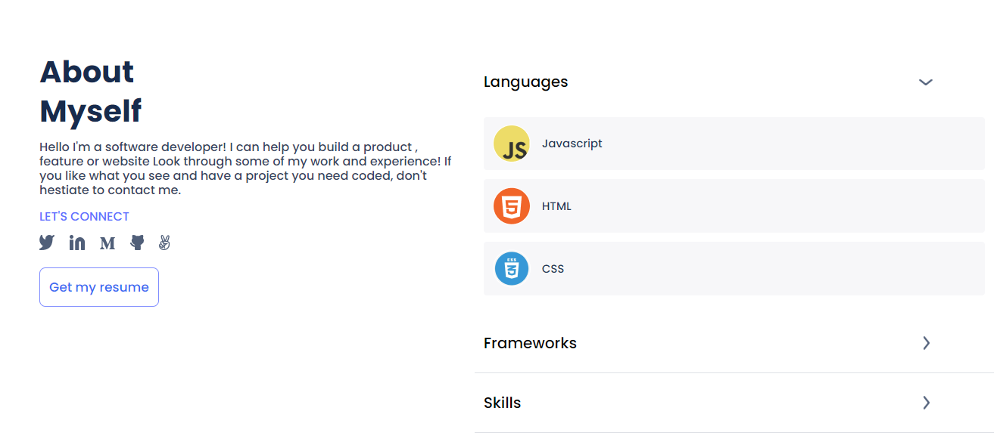

# Portfolio

> This project is about simple portfolio.

## Built With

- Just HTML and CSS

## Live Demo (if available)

[portfolio](https://bahoz-ali.github.io/portfolio)

## Getting Started

**this project is all about creating a nice portfolio**

To get a local copy up and running follow these simple example steps.

### Prerequisites

- Make sure that you installed vscode.

### Setup

- Clone the project using: `git clone git@github.com:bahoz-ali/portfolio.git`

### Usage

Just open the project into the vscode.

## Authors

👤 **Bahoz Ali**

- GitHub: [@githubhandle](https://github.com/bahoz-ali)
- LinkedIn: [LinkedIn](https://www.linkedin.com/in/bahoz-ali/)

## 🤝 Contributing

Contributions, issues, and feature requests are welcome!

Feel free to check the [issues page](../../issues/).

## Show your support

Give a ⭐️ if you like this project!

## Acknowledgments

- Hat tip to anyone whose code was used
- Inspiration
- etc

## 📝 License

This project is [MIT](./MIT.md) licensed.
